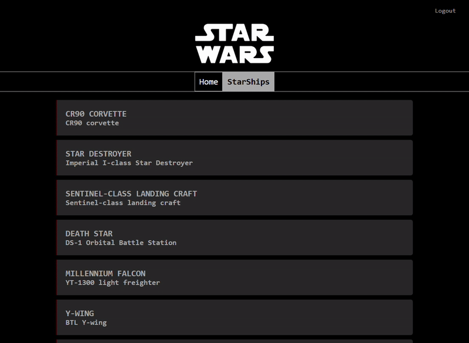
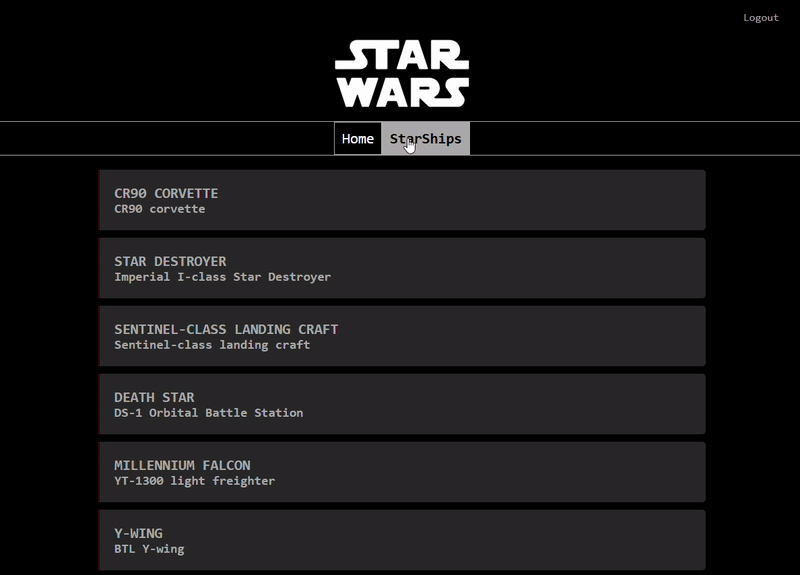

# Sprint 7 - StarWars app


## Index

- [Descripción de la Aplicación](#descripción-de-la-aplicación)
- [Tecnologías](#tecnologías)
- [Estructura del Proyecto](#estructura-del-proyecto)
- [Instalación del Proyecto](#instalación-del-proyecto)
- [Uso](#uso)
- [Vista Previa del Proyecto](#vista-previa-del-proyecto)
- [Tests](#tests)
- [Contribución](#Contribución)
- [GH-Pages](#gh-pages)
- [Autor](#autor)

---

## Descripción de la Aplicación:

Este proyecto consiste en una aplicación Angular que permite explorar el universo de Star Wars a través de sus naves espaciales. El usuario puede visualizar un listado de naves, consultar información detallada de cada una, ver su listado de pilotos y las películas asociadas, y navegar de forma dinámica entre los distintos apartados.

La aplicación está dividida en componentes, e incorpora gestión de rutas, protección de rutas mediante Guards, consumo de APIs externas, formularios reactivos y validaciones. Además, utiliza paginación para la carga eficiente de datos desde la API de Star Wars.

La funcionalidad se ha construido por niveles:
- Listado de naves con información básica (nombre, modelo).
- Ficha detallada de cada nave mostrando todos sus atributos.
- Visualización de pilotos asociados a cada nave.
- Visualización de las películas en las que aparece cada nave.
- Protección de rutas para usuarios registrados.
- Formularios de registro y login de usuarios, con validaciones y gestión de sesión mediante Firebase.

---

## Tecnologías

- `HTML`
- `CSS` / `Bootstrap 5`
- `TypeScript`
- `Angular 20`
- Testing con `Jasmine` / `Karma`

---

## Estructura del Proyecto

```bash
src/
 ├─ app/
 │   ├─ core/
 │   │   ├─ header/
 │   │   └─ services/
 │   │       ├─ starshipsService/
 │   │       └─ userService/
 │   ├─ models/
 │   │   ├─ starship-api-response.model.ts
 │   │   ├─ starship-film-model.ts
 │   │   ├─ starship-pilot.model.ts
 │   │   └─ starship.model.ts
 │   └─ pages/
 │       ├─ auth/
 │       │   ├─ login/
 │       │   └─ register/
 │       ├─ home/
 │       └─ starships/
 │           ├─ starships-list/
 │           ├─ starship-detail/
 │           ├─ starship-info/
 │           ├─ starship-pilots/
 │           └─ starship-films/
 └─ Environments
```

---

## Instalación del proyecto

#### Requisitos previos
- Antes de instalar el proyecto asegúrate de tener:
    - Navegador web
    - node > 22
    - npm > 10
    - Angular CLI (instalado globalmente)
    

1. Clona el repositorio:

```bash
    git clone https://github.com/JordiMiravet/Bootcamp-S7.git
```

2. Instala dependencias:

```bash
    npm install
```

3. Ejecuta el servidor:

```bash
    ng serve
```

4. Abrir en el navegador:

```bash
    http://localhost:4200
```

---

## Uso

Tras iniciar la aplicación, el usuario puede:

1. **Registro y login de usuarios**: Los usuarios pueden crear una cuenta y loguearse para acceder al contenido protegido.
2. **Acceder a la página principal**: Se muestra un listado de naves espaciales con información básica como nombre y modelo.
3. **Navegación paginada**: Solo se cargan inicialmente las primeras 10 naves, y el usuario puede cargar más mediante el _scroll infinito_.
4. **Ver detalles de cada nave**: Haciendo clic en cualquier nave del listado, se accede a su ficha completa con todos los atributos disponibles (fabricante, costo, velocidad, tripulación, pasajeros, clase de nave, etc.).
5. **Explorar pilotos asociados**: Dentro de la ficha de cada nave, se pueden ver tarjetas con los pilotos que la han manejado.
6. **Consultar películas relacionadas**: Se muestran las películas en las que aparece cada nave.
7. **Protección de rutas**: El listado de naves y los detalles solo están disponibles para usuarios registrados.
8. **Navegación dinámica**: El usuario puede volver a la lista de naves o moverse entre secciones mediante la barra de navegación.

---

## Vista Previa del proyecto

1. Registro de usuario
- El usuario puede registrarse únicamente si el correo no está registrado previamente.
- En caso de que el email ya exista, se muestra un mensaje de error.


2. Login de usuario
- El usuario puede iniciar sesión solo si el correo y la contraseña coinciden.
- Si los datos son incorrectos, se muestra un mensaje de error.


3. Logout de usuario
- El usuario puede cerrar sesión.
- Una vez hecho logout, no podrá acceder a la información protegida de la página.



4. Lista de naves:
- Se carga dinámicamente una lista de naves usando scroll infinito.


5. Detalle de una nave especifica
- Se muestran los detalles de la nave seleccionada de la lista.
- Mientras se cargan los datos, se muestra un mensaje de carga y, si ocurre un error, aparece un mensaje de error.




---

## Tests

La aplicación incluye pruebas unitarias con `Jasmine` y se ejecutan mediante `Karma`.  

#### Resumen
- `32 specs` ejecutadas
- `0 fallos`
- Componentes y servicios principales testeados:
    - Componentes: HeaderComponent, LoginComponent, RegisterComponent, StarshipsListComponent, StarshipInfoComponent, StarshipPilotsComponent, StarshipFilmsComponent, StarshipDetailComponent
    - Servicios: UserService, StarshipsService

#### Ejemplo destacado

Se verifica que un usuario pueda loguearse correctamente:

```ts
    it('should call onSubmit and attempt login when form is valid', () => {
    component.formLogin.setValue({
        email: 'pleaseStopTesting@gmail.com',
        password: '123456'
    })
    
    let called = false;
    (component as any).userService.login = () => {
        called = true;
        return Promise.resolve();
    };
    
    component.onSubmit();

    expect(called).toBe(true);
    });
```

También se validan formularios reactivos y mensajes de error:

```ts
    it('should display error messages for invalid email and password', () => {
    const emailControl = component.formLogin.controls['email'];
    const passwordControl = component.formLogin.controls['password'];

    emailControl.setValue(''); 
    emailControl.markAsTouched();
    passwordControl.setValue('');
    passwordControl.markAsTouched();

    expect(emailControl.invalid).toBeTrue();
    expect(passwordControl.invalid).toBeTrue();

    expect(component.message.invalidEmail).toBe('Please enter a valid email');
    expect(component.message.invalidPassword).toBe('Please enter a password that contains at least 6 characters');
    });
```
#### Ejecutar test

- Para correr todos los tests locales:

```bash
    ng test
```

---

## Contribución
 
Para colaborar en este proyecto, sigue estos pasos:

1. Haz un **fork** del repositorio.

```bash
https://github.com/JordiMiravet/Bootcamp-S7.git
```

2. Crea una nueva rama para tu funcionalidad o corrección:

```bash
   git checkout -b feature/nueva-funcionalidad

```

3. Realiza los cambios y asegúrate de que los test pasan correctamente.

4. Haz un commit siguiendo las Conventional Commits:

```bash
    feat: añade nueva funcionalidad
    fix: corrige error
    docs: actualiza documentación
```

5. Envía un Pull Request describiendo tus cambios.

---

## GH-Pages
[Abrir proyecto](https://jordimiravet.github.io/Bootcamp-S7/)

---

## Autor

```bash
    Jordi Miravet – Bootcamp S7 : StarWars app
```